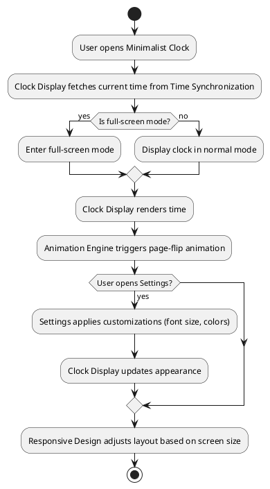

# **Software Architecture Design Document**

## **1. System Architecture**
The system architecture for the Minimalist Clock is designed to support modularity, maintainability, and a seamless user experience. It consists of multiple modules interacting through well-defined interfaces.

### **1.1 C4 Diagrams**

#### **Context Diagram**
```plantuml
@startuml
!include https://raw.githubusercontent.com/plantuml-stdlib/C4-PlantUML/master/C4_Context.puml

Person(user, "Tech-Savvy Decorator", "User who interacts with the Minimalist Clock")
System(clock, "Minimalist Clock", "Web-based application displaying time with customization options")

Rel(user, clock, "Uses")
@enduml
```
- **External User**: The Tech-Savvy Decorator interacts with the Minimalist Clock.
- **Third-Party Dependencies**: None (the system relies solely on the user's system time).

#### **Container Diagram**
```plantuml
@startuml
!include https://raw.githubusercontent.com/plantuml-stdlib/C4-PlantUML/master/C4_Container.puml

Person(user, "Tech-Savvy Decorator", "User who interacts with the Minimalist Clock")
System_Boundary(clock, "Minimalist Clock") {
    Container(clock_display, "Clock Display", "HTML/CSS/JavaScript", "Renders time and animations")
    Container(settings, "Settings", "JavaScript", "Handles user customizations")
    Container(time_sync, "Time Synchronization", "JavaScript", "Fetches system time")
    Container(responsive, "Responsive Design", "React Hook", "Detects viewport and scales layout dynamically")
    Container(animation, "Animation Engine", "JavaScript", "Manages page-flip animations")
}

Rel(user, clock_display, "Views time and customizes appearance")
Rel(clock_display, time_sync, "Fetches current time")
Rel(clock_display, settings, "Applies customizations")
Rel(clock_display, animation, "Triggers animations")
Rel(clock_display, responsive, "Adjusts layout dynamically")
@enduml
```
- **Clock Display**: Central module that renders time and animations.
- **Settings**: Handles user preferences and applies them to the clock.
- **Time Synchronization**: Updates the clock with the current system time.
- **Responsive Design**: Ensures the clock adapts to different devices.
- **Animation Engine**: Provides smooth page-flip effects.

#### **Component Diagram**
```plantuml
@startuml
!include https://raw.githubusercontent.com/plantuml-stdlib/C4-PlantUML/master/C4_Component.puml

Container(clock_display, "Clock Display", "HTML/CSS/JavaScript", "Renders time and animations") {
    Component(time_renderer, "Time Renderer", "JavaScript", "Displays hour, minute, and date")
    Component(animation_handler, "Animation Handler", "JavaScript", "Manages page-flip animations")
}

Container(settings, "Settings", "JavaScript", "Handles user customizations") {
    Component(font_size_controller, "Font Size Controller", "JavaScript", "Adjusts font size")
    Component(color_picker, "Color Picker", "JavaScript", "Changes font and background colors")
}

Container(time_sync, "Time Synchronization", "JavaScript", "Fetches system time") {
    Component(time_fetcher, "Time Fetcher", "JavaScript", "Retrieves current system time")
}

Container(responsive, "Responsive Design", "React Hook", "Ensures layout adapts to screen sizes") {
    Component(responsive_hook, "Responsive Layout Hook", "TypeScript", "Detects viewport size and calculates scale factor")
}

Container(animation, "Animation Engine", "JavaScript", "Manages page-flip animations") {
    Component(animation_timer, "Animation Timer", "JavaScript", "Controls animation duration")
}

Rel(time_renderer, time_fetcher, "Fetches time")
Rel(time_renderer, animation_handler, "Triggers animations")
Rel(animation_handler, animation_timer, "Configures animation speed")
Rel(font_size_controller, time_renderer, "Applies font size changes")
Rel(color_picker, time_renderer, "Applies color changes")
Rel(time_renderer, media_queries, "Adjusts layout dynamically")
@enduml
```
- **Time Renderer**: Displays the current time and triggers animations.
- **Animation Handler**: Manages page-flip effects using a timer.
- **Font Size Controller** and **Color Picker**: Apply user customizations to the clock.
- **Media Queries**: Ensure the clock adapts to different screen sizes.

### **1.2 Component Interaction Flowchart**

- The flowchart illustrates the sequence of interactions between modules.

---

## **2. Technology Stack**
The technology stack is chosen to align with your preferences for TypeScript, Next.js, Styled Components, and AWS deployment.

### **2.1 Programming Languages**
- **Frontend**: TypeScript (static typing for enhanced code quality).
- **Styling**: CSS3 (with Styled Components for dynamic theming).

### **2.2 Frameworks and Libraries**
- **Frontend Framework**: Next.js (React-based framework for static site generation and server-side rendering).
- **Styling**: Styled Components (CSS-in-JS library for scoped styling).
- **Animation Library**: GSAP (GreenSock Animation Platform for smooth page-flip effects).
- **State Management**: React Context API (for managing global state like user preferences).
- **Component Visualization**: Storybook (for developing and testing UI components in isolation).

### **2.3 Storage**
- **Local Storage**: Persists user customizations (font size, colors) across sessions.

### **2.4 Build Tools**
- **Package Manager**: npm or Yarn for dependency management.
- **Bundler**: Built-in Next.js bundler (Webpack under the hood).

### **2.5 Testing**
- **Unit Testing**: Jest with React Testing Library.
- **End-to-End Testing**: Cypress.

### **2.6 Deployment**
- **Hosting**: AWS S3 + CloudFront.
- **CI/CD**: GitHub Actions for automated builds and deployments.

---

## **3. Data Model**
The Minimalist Clock uses local storage for persisting user preferences. Below are the core data structures:

### **3.1 Core Data Structures**
1. **User Preferences Object**:
   ```json
   {
     "fontSize": 48,
     "fontColor": "#FFFFFF",
     "backgroundColor": "#000000",
     "showSeconds": false,
     "flipStyle": "drop-down"
   }
   ```
   - **flipStyle**: Animation style for digit transitions. Options: `"classic-flip"` (full 3D rotateX flip from -90 to 0 degrees), `"drop-down"` (upper half drops down with 3D perspective), or `"card-fold"` (vertical fold from top edge downward using rotateX from -180 to 0 degrees). Default: `"drop-down"`.
2. **Time Object**:
   ```json
   {
     "hours": 10,
     "minutes": 30,
     "seconds": 45,
     "date": "2023-10-05"
   }
   ```

### **3.2 Local Storage Schema**
- **Key**: `userPreferences`
  - **Value**: JSON string representing user preferences.
- **Key**: `lastViewedTime` (optional)
  - **Value**: JSON string representing the last viewed time.

---

## **4. Interface Specification**
The interface specification defines internal module-to-module communication.

### **4.1 Clock Display Module**
- **Method**: `renderTime(timeObject)`
  - **Input**:
    ```json
    {
      "hours": 10,
      "minutes": 30,
      "seconds": 45,
      "date": "2023-10-05"
    }
    ```
  - **Output**: None (updates the UI).

- **Method**: `triggerAnimation()`
  - **Input**: None.
  - **Output**: None (updates the UI).

### **4.2 Settings Module**
- **Method**: `applyCustomizations(preferences)`
  - **Input**:
    ```json
    {
      "fontSize": 48,
      "fontColor": "#FFFFFF",
      "backgroundColor": "#000000",
      "showSeconds": false,
      "flipStyle": "drop-down"
    }
    ```
  - **Output**: None (updates the UI).

- **Method**: `savePreferences(preferences)`
  - **Input**:
    ```json
    {
      "fontSize": 48,
      "fontColor": "#FFFFFF",
      "backgroundColor": "#000000",
      "showSeconds": false,
      "flipStyle": "drop-down"
    }
    ```
  - **Output**: None (persists data).

### **4.3 Time Synchronization Module**
- **Method**: `fetchCurrentTime()`
  - **Output**:
    ```json
    {
      "hours": 10,
      "minutes": 30,
      "seconds": 45,
      "date": "2023-10-05"
    }
    ```

### **4.4 Responsive Design Module**
The Responsive Design Module automatically adjusts the clock layout to fit different screen sizes and device types.

- **Hook**: `useResponsiveLayout`
  - **Returns**:
    ```typescript
    {
      viewport: 'mobile' | 'tablet' | 'desktop',
      scaleFactor: number
    }
    ```
  - **Behavior**:
    - Detects viewport size on mount using `window.innerWidth`
    - Calculates appropriate scale factor based on viewport type:
      - Mobile (<768px): 0.4 - 0.6 scale
      - Tablet (768px-1024px): 0.75 - 1.0 scale
      - Desktop (>1024px): 1.0 - 1.5 scale
    - Listens to window resize events with 250ms debounce
    - Updates layout dynamically when viewport changes
    - Cleans up event listeners on unmount

- **Integration with ClockDisplay and TimeRenderer**:
  - ClockDisplay uses `useResponsiveLayout` hook to get current scale factor
  - Scale factor is passed to TimeRenderer component
  - TimeRenderer applies scale factor to base font size: `fontSize * scaleFactor`
  - Ensures clock maximizes screen space on all devices
  - Maintains aspect ratio and readability across viewports

- **Performance Optimization**:
  - Resize events debounced to prevent excessive re-renders
  - Initial viewport detection uses SSR-safe approach
  - Scale calculation uses efficient arithmetic operations
  - Event listener cleanup prevents memory leaks

### **4.5 Animation Module**
The Animation Module implements page-flip animations for time digit transitions using GSAP.

- **Component**: `AnimationHandler`
  - **Props**:
    - `trigger` (boolean): When true, triggers the animation
    - `duration` (number, optional): Animation duration in seconds (default: 0.75)
    - `children` (ReactNode): Content to be animated
  - **Behavior**:
    - Applies 3D perspective transformation for realistic page-flip effect
    - Uses rotateX transformation from -90° to 0° for flip animation
    - Includes opacity transition for smooth appearance
    - Easing function: `power2.out` for natural deceleration

- **Integration with ClockDisplay**:
  - ClockDisplay monitors time changes every second
  - When minute or second value changes, triggers animation by setting `shouldAnimate` to true
  - Animation trigger resets after 100ms to prepare for next animation
  - Animation duration: 750ms (meets User Story 2.2 requirement)
  - Supports independent animation triggers for all 6 digits (HH:MM:SS) when seconds are enabled

- **Performance Optimization**:
  - Animation only triggers on minute changes, not every second
  - Uses GSAP's hardware-accelerated transformations
  - Minimal re-renders through controlled state updates

---

## **5. Deployment Architecture**
The Minimalist Clock is deployed as a static web application using AWS S3 + CloudFront.

### **5.1 Hosting**
- **AWS S3**: Stores static assets.
- **CloudFront**: Distributes content globally via CDN.

### **5.2 Security**
- HTTPS enforced via AWS Certificate Manager (ACM).
- CSP headers configured for enhanced security.

### **5.3 CI/CD Pipeline**
- **GitHub Actions**: Automates builds, tests, and deployments to S3 + CloudFront.

---

## **6. Repository Structure**
The repository is organized to ensure maintainability and ease of navigation.

```
minimalist-clock/
├── .github/                # GitHub Actions workflows
│   └── workflows/
│       └── deploy.yml      # CI/CD pipeline
├── public/                 # Static assets
│   ├── fonts/              # Custom fonts
│   └── favicon.ico         # Favicon
├── src/                    # Source code files
│   ├── components/         # Reusable React components
│   ├── pages/              # Next.js pages
│   ├── styles/             # Styled Components and global styles
│   ├── utils/              # Utility functions
│   └── types/              # TypeScript type definitions
├── stories/                # Storybook stories
├── tests/                  # Test files
├── .storybook/             # Storybook configuration
├── next.config.js          # Next.js configuration
├── jest.config.js          # Jest configuration
├── cypress.config.js       # Cypress configuration
├── tsconfig.json           # TypeScript configuration
├── package.json            # Project dependencies and scripts
└── README.md               # Project overview
```